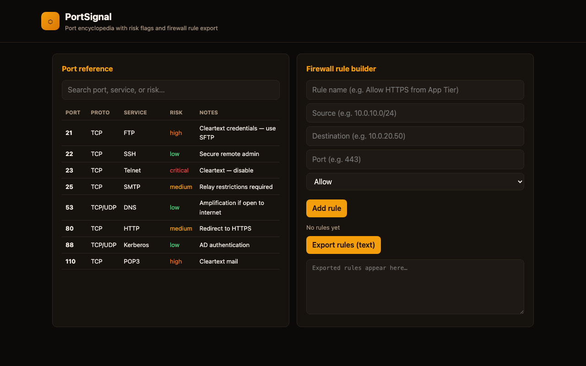
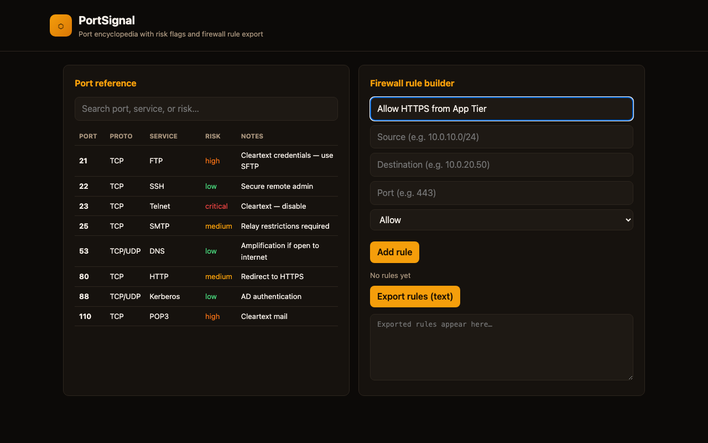

# PortSignal

**Port encyclopedia and firewall rule doc builder** — searchable reference for common TCP/UDP ports with risk flags, plus a simple rule builder that exports markdown for change requests.

Stop googling "what port is LDAP" during a firewall ticket. Build the rule doc once, export it, attach to the ticket.

## Screenshots

 |
 |

## What it does

| Feature | Purpose |
|---------|---------|
| **Port database** | 40+ common services with protocol, risk level, and notes |
| **Search** | Filter by port number, service name, or risk tag |
| **Rule builder** | Source, destination, port, protocol → markdown export |
| **Saved rules** | Persist rules in localStorage for reuse |

## Run

Requires a local web server (port data loads via `fetch()`).

### Linux

```bash
git clone <your-repo-url>
cd PortSignal
python3 -m http.server 8080
```

Open http://localhost:8080

### Windows

```powershell
git clone <your-repo-url>
cd PortSignal
python -m http.server 8080
```

Open http://localhost:8080

### macOS

```bash
git clone <your-repo-url>
cd PortSignal
python3 -m http.server 8080
open http://localhost:8080
```

## Project structure

```
PortSignal/
├── index.html
├── css/styles.css
├── js/app.js
├── data/ports.json
├── media/
└── README.md
```

## License

MIT
